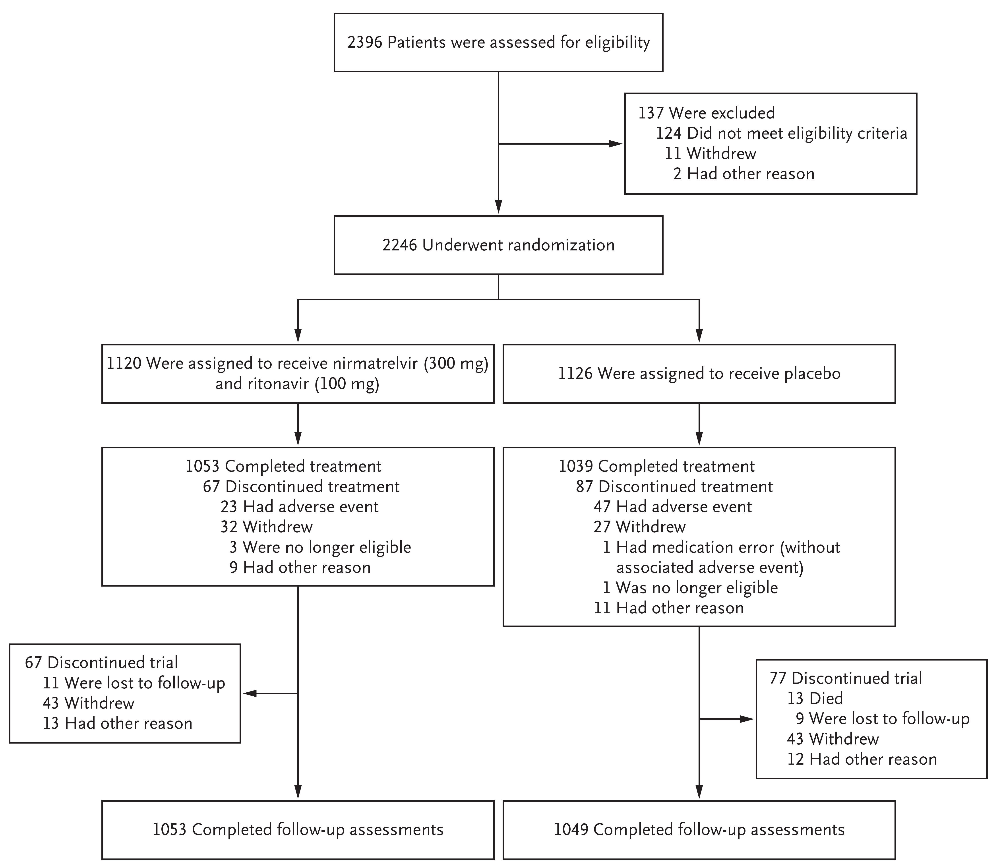
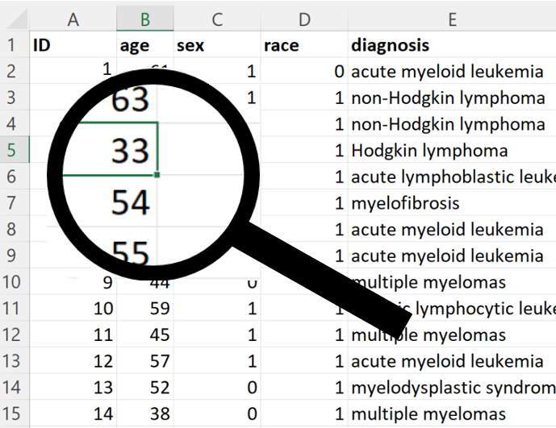

```{r setup, include=FALSE}
knitr::opts_chunk$set(echo = TRUE, fig.align="center")
options(width=132)
```

---

# **Outline of this talk**

&nbsp;

###### Part 1
##### Drawing a CONSORT flow diagram

&nbsp;

###### Part 2
##### Data exploration 

```{r, eval=FALSE,echo=FALSE}
---

# CONSORT diagrams

* The randomized controlled trial (or RCT) is one of humanity's greatest achievements.

* It's considered the gold standard of evidence about interventions.

* But to live up to this billing, an RCT has to be done **well**, and for readers to have confidence in the results of an RCT, there has to be transparent reporting.

* A major step forward in this regard was the CONSORT statement, originally published in 1996, a key element of which is the CONSORT diagram.

------------------------------------------------------[Show CONSORT diagram]------------------------------------------------------

* Here is a CONSORT diagram. It's from the randomized trial of paxlovid antiviral treatment for Covid published in April in the New England Journal of Medicine.

* The CONSORT diagram is key because it shows exactly how the study sample was obtained, starting with people assessed for eligibility in the study, through informed consent, randomization, and finally data analysis.
```

---

# **Part 1: Drawing a CONSORT flow diagram**

```{r, echo=FALSE, fig.alt="CONSORT flow diagram",out.width="55%",fig.align = 'center'}
knitr::include_graphics("CONSORT.png")
```

---

# Does treatment of COVID-19 with paxlovid reduce hospitalization and death?

```{r, echo=FALSE, fig.alt="Biden has begun taking Paxlovid, an antiviral medication shown to prevent serious Covid cases",out.width="60%",fig.align = 'center',out.extra='style="background-color: DarkGrey; padding:2px; display: block; margin-left: auto; margin-right: auto;"'}

```

&nbsp;

> Hammond J, Leister-Tebbe H, Gardner A, et al. Oral Nirmatrelvir for High-Risk, Nonhospitalized Adults with Covid-19. N Engl J Med. 2022;386(15):1397-1408.


---

```{r, echo=FALSE, fig.alt="Hammond J, Leister-Tebbe H, Gardner A, et al. Oral Nirmatrelvir for High-Risk, Nonhospitalized Adults with Covid-19. N Engl J Med. 2022;386(15):1397-1408.",out.width="65%",fig.align = 'center'}

```

```{r, eval=FALSE,echo=FALSE}
---

# The story of vtree

* If you work out the numbers to fill in to a CONSORT diagram by hand, 
it can be quite error prone.

* I wanted to reproducibly draw what I call "sample selection flow diagrams".

* These are tree diagrams, and a tree is a simple graph (i.e. a node-and-edge diagram).

* The **DiagrammeR** package lets you draw graphs (node and edge diagrams) based on the **Graphviz** software and the **DOT** language.

* But how can you calculate the numbers automatically?

* You could specify a fixed structure for the CONSORT diagram,
but then the program would only work for that particular structure.
I wanted it to work for all kinds of sample selection flow diagrams.

* It turned out to be easier to solve a more general problem:
making a tree of nested subsets based on the values of variables.

* I called this a variable tree, and hence the package became **vtree**.

* It turns out that variable trees are very useful for all kinds of data exploration.

* But let's start with the original example: a CONSORT diagram.
```

---

```{r, echo=FALSE,warning=FALSE,message=FALSE}
library(vtree)
library(dplyr)
```

```{r, echo=FALSE}
p <- build.data.frame(
  c(  "rand","exc1","exc2","oth1", "group","died","dis1","dis2","dis3","fu"),
  list(F,    T,     F,     F,      NA,     NA,    NA,    NA,    NA,    FALSE, 124),
  list(F,    F,     T,     F,      NA,     NA,    NA,    NA,    NA,    FALSE, 11),
  list(F,    F,     F,     T,      NA,     NA,    NA,    NA,    NA,    FALSE, 2),
  list(T,    F,     F,     F,      "A",    F,     T,     F,     F,     FALSE, 11),
  list(T,    F,     F,     F,      "A",    F,     F,     T,     F,     FALSE, 43),
  list(T,    F,     F,     F,      "A",    F,     F,     F,     T,     FALSE, 13),
  list(T,    F,     F,     F,      "A",    F,     F,     F,     F,     TRUE, 1053),
  list(T,    F,     F,     F,      "B",    T,     F,     F,     F,     FALSE, 13),
  list(T,    F,     F,     F,      "B",    F,     T,     F,     F,     FALSE, 9),
  list(T,    F,     F,     F,      "B",    F,     F,     T,     F,     FALSE, 43),
  list(T,    F,     F,     F,      "B",    F,     F,     F,     T,     FALSE, 12),
  list(T,    F,     F,     F,      "B",    F,     F,     F,     F,     TRUE, 1049))
#illustrate <- c(1,125,136,138,149,192,205,1258,1271,1380,1423,1435)
illustrate <- c(125,1380,192,205,1258,1)
p <- rbind(p[illustrate,],p[-illustrate,])
p <- data.frame(tibble(p)) # reset row numbers
```

# A data frame for the paxlovid CONSORT diagram

* I noticed an apparent error in the published CONSORT diagram: 2396 patients were assessed for eligibility and then 137 were excluded (which would leave **2259**) but the diagram indicates that only **2246** were randomized

* I will assume 2396 is a misprint, and that in fact 2383 were assessed for eligibility

* **vtree** takes a data frame as input

* I made a data frame, `p`, representing the flow of each patient

```{r}
dim(p)
```

```{r}
head(p)
```

---

# A single layer tree

```{r}
table(p$rand)
```

```{r,message=FALSE,out.width="40%"}
vtree(p, "rand", horiz=FALSE)
```

---

# A two-layer tree

```{r}
table(p$rand, p$group, exclude=NULL)
```

```{r,message=FALSE,out.width="40%"}
vtree(p, "rand group", horiz=FALSE)
```
  
---

# Pruning a node

```{r,message=FALSE,out.width="40%"}
vtree(p, "rand group", follow=list(rand=TRUE), horiz=FALSE)
```

---

# A three-layer tree

```{r,message=FALSE,out.width="40%"}
vtree(p, "rand group fu", follow=list(rand=TRUE), horiz=FALSE)
```

---


# Adding labels

```{r,message=FALSE,out.width="40%"}
vtree(p, "rand group fu", follow=list(rand=TRUE), horiz=FALSE, showvarnames=FALSE, title="Assessed for eligibility",
  labelnode=list(rand=c(Excluded=FALSE, Randomized=TRUE), fu=c("Discontinued trial"=FALSE, "Followed up"=TRUE)))
```

---

# Summaries in vtree

```{r, eval=FALSE}
summary="variable_name format_string"
```

The format string consists of text and special codes.

For example, `exc1` indicates whether an individual was excluded because they didn't meet eligibility criteria.

```{r, eval=FALSE}
summary="exc1 Did not meet eligibility criteria: %sum%"
```

In the CONSORT diagram this generates the output:

**Did not meet eligibility criteria: 124**

---

# Summary text + some finishing touches

```{r,message=FALSE,out.width="40%"}
vtree(p, "rand group fu", follow=list(rand=TRUE), horiz=FALSE, showvarnames=FALSE, title="Assessed for eligibility", 
  labelnode=list(rand=c(Excluded=FALSE, Randomized=TRUE), fu=c("Discontinued trial"=FALSE, "Followed up"=TRUE)),
  summary=c("exc1 \nDid not meet eligibility criteria: %sum%%var=rand%%node=FALSE%",
    "exc2 \nWithdrew: %sum%%var=rand%%node=FALSE%", "oth1 \nHad other reason: %sum%%var=rand%%node=FALSE%",
    "died \nDied: %sum%%var=fu%%node=FALSE%", "dis1 \nLost to follow-up: %sum%%var=fu%%node=FALSE%",
    "dis2 \nWithdrew: %sum%%var=fu%%node=FALSE%", "dis3 \nHad other reason: %sum%%var=fu%%node=FALSE%"),
  splitwidth=Inf, fillcolor="white", rootfillcolor="white", showpct=FALSE)
```

---

# **Part 2: Data Exploration**

```{r, echo=FALSE, fig.alt="Spreadsheet magnifier",out.width="55%",fig.align = 'center'}

```


---

# A retrospective cohort study

Here's a dataset from the **medicaldata** package, as reported in this paper:

> Sobecks et al. “Cytomegalovirus Reactivation After Matched Sibling Donor
> Reduced-Intensity Conditioning Allogeneic Hematopoietic Stem Cell Transplant
> Correlates With Donor Killer Immunoglobulin-like Receptor Genotype”. Exp Clin
> Transplant 2011; 1: 7-13.

It's about the risk of cytomegalovirus (CMV) reactivation in patients being treated with bone marrow stem cell transplant


```{r, warning=FALSE}
library(medicaldata)
dim(cytomegalovirus)
```

```{r}
print(names(cytomegalovirus),quote = FALSE)
```

---

# Frequencies

```{r, out.width="25%"}
vtree(cytomegalovirus,"diagnosis",pattern=TRUE)
```

```{r,message=FALSE,out.width="30%",eval=FALSE,echo=FALSE}
vtree(cytomegalovirus, "prior.transplant")

Could use `labelnode` to relabel:

vtree(cytomegalovirus, "prior.transplant", labelnode=list(prior.transplant=c(No=0,Yes=1)))
```

---

# For convenience, I'll relabel some variables

```{r, warning=FALSE, message=FALSE}
library(forcats)
library(dplyr)
stemcell <- cytomegalovirus %>%
  mutate(
    CMV              = fct_recode(as.character(cmv), "CMV reactivation"="1", "No CMV reactivation"="0"),
    sex              = fct_recode(as.character(sex), Male="1", Female="0"),
    race             = fct_recode(as.character(race), White="1", "African American"="0"),
    diagnosis.type   = fct_recode(as.character(diagnosis.type), Myeloid="1", Lymphoid="0"),
    prior.transplant = fct_recode(as.character(prior.transplant), "No prior transplant"="0", "Prior transplant"="1"),
    prior.radiation  = fct_recode(as.character(prior.radiation), "No radiation"="0", "Radiation"="1"),
    c1c2             = fct_recode(as.character(`C1/C2`), Heterozygous="0", Homozygous="1"))  
```

```{r,message=FALSE,out.width="40%", eval=FALSE, echo=FALSE}
vtree(stemcell, "prior.transplant", showvarnames=FALSE)
```

---

# Patterns

```{r, out.width="45%"}
vtree(stemcell, "sex c1c2 prior.radiation", pattern=TRUE, showvarnames=FALSE)
```

---

# CMV reactivation (R) post-transplant

```{r,out.width="65%"}
vtree(stemcell, "sex c1c2 prior.radiation", sameline=TRUE, showvarnames=FALSE, summary="cmv   \nR %npct%", splitwidth=Inf)
```

---

# Quantitative variables

Although vtree focuses on discrete variables, it has some support for quantitative variables.

> The primary risk factor of interest was the number of activating killer
> immunoglobulin-like receptors (aKIRs: 1-4 vs. 5-6).

```{r, out.width="50%"}
vtree(stemcell, "cmv", summary="aKIRs \naKIRS mean (SD) %mean% (%SD%)", 
  labelnode=list(cmv=c("No"=0,"Yes"=1)), labelvar=c(cmv="CMV reactivation"))
```

---

# Dichotomizing a quantitative variable

```{r, out.width="30%"}
vtree(stemcell, "aKIRs>=5", summary="cmv \nR: %npct%")
```

---

# Thanks!

###### For more information
##### vtree is available on CRAN
##### See also the vtree webpage: https://nbarrowman.github.io/vtree

###### Acknowledgements

##### Richard Webster
##### Sebastian Gatscha

###### **Questions?**
